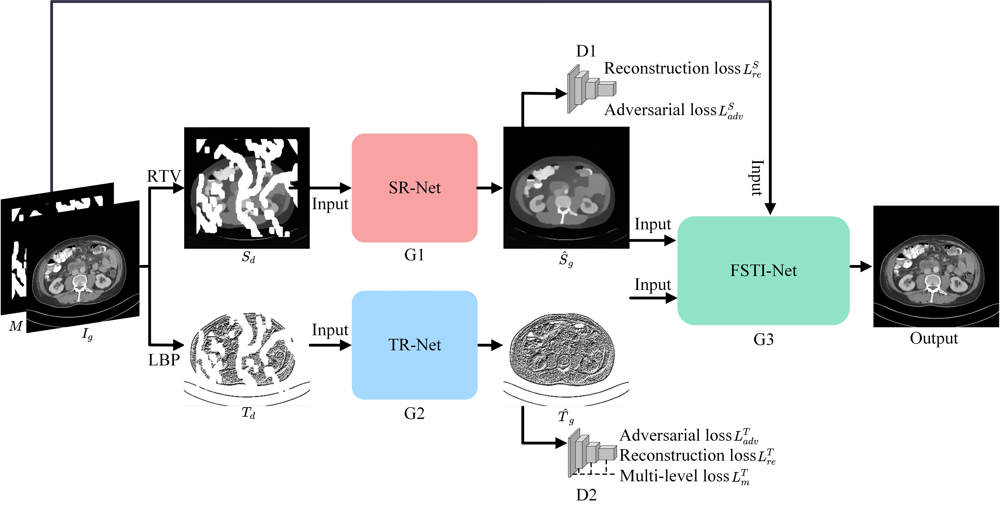
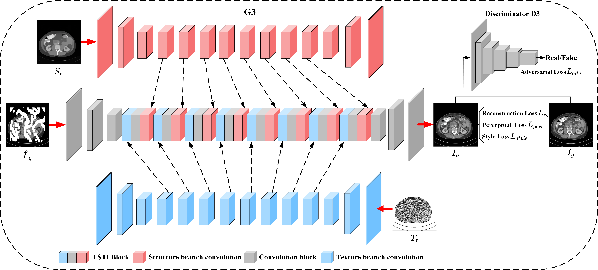
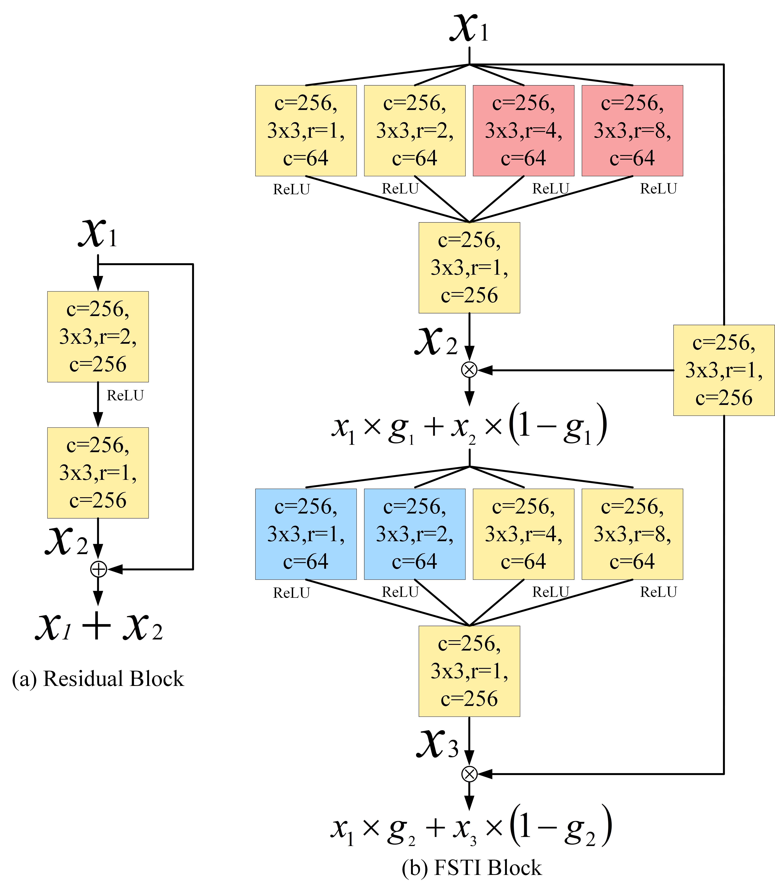

# FSTI-GAN
Code for our paper "[FSTI-GAN: Fusion of Structural and Textural Information (FSTI) in Generative Adversarial Network (GAN) to Improve Medical Image Inpainting]" (Submitted 2024)

### Introduction

The model combines the concept of two-stage and parallel structure image inpainting. Initially, the inpainting task is divided into two tasks: **structure reconstruction** and **texture reconstruction**. The structure images are obtained by the edge-preserved smooth method, and the texture images are obtained by the Local Binary Pattern (LBP). However, obtaining reasonable structure and fine texture remains an extremely challenging task. In the subsequent **inpainting process**, **poor structural and textural information** is bound to seriously mislead the inpainted results. Aiming at this problem, we improved the structure of the feature reconstruction model and obtained better prediction results of unknown regions. Furthermore, to tackle the problem of adaptive fusion of multiple features, we proposed a novel parallel embedding network with a two-stream architecture. By stacking multiple FSTI Block in it, the network can maintain the global consistency of structure and texture information during the inpainting process while enhancing the model's reasoning capabilities regarding contextual information. The bidirectional interaction between structure-guided texture synthesis and texture-facilitated structure reconstruction is realized, ultimately leading to an improvement in inpainting quality.

<p align='center'>  
  
</p>
<p align='center'> 

</p>

### Requirements

1. Pytorch >= 1.0
2. Python 3
3. NVIDIA GPU + CUDA 9.0
4. Tensorboard
5. Matlab

### Installation

Clone this repository

   ```bash
   git clone https://github.com/QUST-SmartData/FSTI-GAN
   ```


### Running

**1.	Image Prepare**

We train our model on three public datasets including CHAOS, and DeepLesion. We use the irregular mask dataset provided by [PConv](https://arxiv.org/abs/1804.07723). You can download these datasets from their project website.

1. [CHAOS](https://zenodo.org/records/3431873#.Yl_9itpBxaQ)
2. [DeepLesion](https://nihcc.app.box.com/v/DeepLesion)
3. [Irregular Masks](http://masc.cs.gmu.edu/wiki/partialconv)

After downloading the datasets, The edge-preserved smooth images can be obtained by using [RTV smooth method](http://www.cse.cuhk.edu.hk/~leojia/projects/texturesep/). Run generation function [`scripts/matlab/generate_structre_images.m`](scripts/matlab/generate_structure_images.m) in your matlab. For example, if you want to generate smooth images for CHAOS, you can run the following code:

```matlab
generate_structure_images("path to CHAOS dataset root", "path to output folder");
```

Finally, you can generate the image list using script  [`scripts/flist.py`](scripts/flist.py) for training and testing.

**2.	Training**

To train our model, modify the model config file [model_config.yaml](model_config.yaml). You may need to change the path of dataset or the parameters of the networks etc. Then run the following code:

```bash
python train.py \
--name=[the name of your experiment] \
--path=[path save the results] 
```

**3.	Testing**

To output the generated results of the inputs, you can use the [test.py](test.py).  Please run the following code:

```bash
python test.py \
--name=[the name of your experiment] \
--path=[path of your experiments] \
--input=[input images] \
--mask=[mask images] \
--structure=[structure images] \
--texture=[texture images] \
--output=[path to save the output images] \
--model=[which model to be tested]
```

To evaluate the model performance over a dateset, you can use the provided script [./scripts/matric.py](scripts/metrics.py). This script can provide the PSNR, SSIM and Fréchet Inception Distance ([FID score](https://github.com/mseitzer/pytorch-fid))  of the results.

```bash
python ./scripts/metrics.py \
--input_path=[path to ground-truth images] \ 
--output_path=[path to model outputs] \
--fid_real_path=[path to the real images using to calculate fid]
```

For example you can download the checkpoints of CHAOS and save them to './results/places/checkpoints' and run the following code:

```bash
python test.py \
--name=places \
--path=results \
--input=./example/CHAOS/1.jpg \
--mask=./example/CHAOS/1_mask.png \
--structure=./example/CHAOS/1_tsmooth.png \
--texture=./example/CHAOS/1_tsmooth.png \
--output=./result_images \
--model=3
```

### Citation

If you find this code is helpful for your research, please cite our paper:

```
Submitted
```


### Acknowledgements

We built our code based on [StructureFlow](https://github.com/RenYurui/StructureFlow)、[AOT-GAN](https://github.com/researchmm/AOT-GAN-for-Inpainting)、[Edge-Connect](https://github.com/knazeri/edge-connect) and [LBP](https://github.com/HighwayWu/ImageInpainting). Part of the code were derived from [FlowNet2](https://github.com/NVIDIA/flownet2-pytorch). Please consider to cite their papers. 
